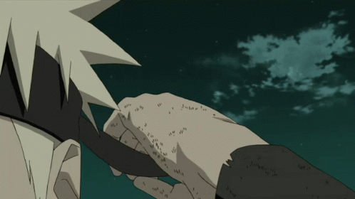

- 👋 Hi, I’m @NandishKumar11
- 👀 about me: Iam 18 years old and that i am a student at univestiy of southwales
- 🌱 What am I doing: I currently study computer science and i worked part time at my parents shop. 
- 💞️ Skillset: I personally think that i have a good understanfing and skillset of computers and that i have done some coding in college 
- 📫 Recent Project Completed: With the use of visiualcode i was able to code and completed the latest assignment in programming. 
- 🌱 Hobbies: In my spare Time  i enjoy playing games and watch some football 
<!---
NandishKumar11/NandishKumar11 is a ✨ special ✨ repository because its `README.md` (this file) appears on your GitHub profile.
You can click the Preview link to take a look at your changes.
--->
<!DOCTYPE html>
</style>
<body>
 <link rel="stylesheet" href="README.html">
 
 
 

    <a class="active" href="#home">🏠Home </a>
    <a href="#AboutMe">👀 about me</a>
    <a href="#contact">💞️ Skillset</a>
    <a href="#about"> 📫 Recent Project</a>
    <a href="Expirence">💻Expirence </a>
    <a href="#ContactMe">☎️Contact me </a>
    
    
  

      
      
   

    

      <h1 style="font-size:50px">👋 Hi, I’m @NandishKumar11</h1>
      
Welcome to My Porfolio Page

    

   

     
   

    

      
    

    

      
    

    

      
    

  

      

      <h1>👀 About Me:👦🏽</h1>
      <a href="#Aboutme">
     

      

        
      

     

        <h1>My Background</h1>
        
A bit About Me/Why you should work with me 

        

         Hey there! I'm Nandish Kumar, 18 years old and studying Computer Science at the University of South Wales. I love diving into the world of technology, coding, and everything that involves problem-solving. At university, I'm learning how to create amazing things with computers. I'm super excited about what the future holds in this field and can't wait to make my mark in the world of computer science!
         In my 1st yearat the univesity i have already learned and develpoed my coding skill with the use of c++ and the use of writting the a perefect report.In Addition to that i have also learned the importants of the security around the degree.
         In my spare time i like to play video games 🮠, Play football ⚽,Watching Anime📺  and also like learning new langauge 📖 to advance speaking knowledge.

       

    

           
      

      

        

          <h2>|Personal Skills/Skillset💞️|</h2>
          
&nbsp;&nbsp;&nbsp;&nbsp;&nbsp;&nbsp;&nbsp;&nbsp;&nbsp;&nbsp;&nbsp;&nbsp;&nbsp;&nbsp;&nbsp;&nbsp;&nbsp;&nbsp;&nbsp;&nbsp;✅Htmt✅

          
&nbsp;&nbsp;&nbsp;&nbsp;&nbsp;&nbsp;&nbsp;&nbsp;&nbsp;&nbsp;&nbsp;&nbsp;&nbsp;&nbsp;&nbsp;&nbsp;&nbsp;&nbsp;&nbsp;&nbsp;✅ Css✅ 

          
&nbsp;&nbsp;&nbsp;&nbsp;&nbsp;&nbsp;&nbsp;&nbsp;&nbsp;&nbsp;&nbsp;&nbsp;&nbsp;&nbsp;&nbsp;&nbsp;&nbsp;&nbsp;&nbsp;&nbsp;✅ C++✅ 

          
&nbsp;&nbsp;&nbsp;&nbsp;&nbsp;&nbsp;&nbsp;&nbsp;&nbsp;&nbsp;&nbsp;&nbsp;&nbsp;&nbsp;&nbsp;&nbsp;&nbsp;&nbsp;&nbsp;&nbsp;✅Rstudio✅

        

        

          <h2>|In Process/Want to Learn|</h2>
          
&nbsp;&nbsp;🖊️Java Script🖊️ &nbsp;&nbsp;&nbsp;&nbsp;&nbsp;&nbsp;&nbsp;&nbsp;&nbsp;&nbsp;&nbsp;🖊️C🖊️ &nbsp;&nbsp;&nbsp;&nbsp;&nbsp;&nbsp;&nbsp;🖊️C##🖊️ &nbsp;&nbsp;&nbsp;&nbsp;&nbsp;

          
&nbsp;&nbsp;🖊️JavaBoostrap🖊️&nbsp;&nbsp;&nbsp;&nbsp;&nbsp;🖊️SASS🖊️&nbsp;&nbsp;&nbsp;&nbsp;&nbsp;🖊️Firebase🖊️

          
&nbsp;&nbsp;&nbsp;&nbsp;&nbsp;🖊️Git🖊️&nbsp;&nbsp;&nbsp;&nbsp;&nbsp;&nbsp;&nbsp;&nbsp;&nbsp;&nbsp;&nbsp;&nbsp;&nbsp;&nbsp;🖊️And many More🖊️

        

        

           <h2>|Achievement✅|</h2>
           
&nbsp;&nbsp;A-level Maths➕

           
&nbsp;&nbsp;A-Level Business👨🏽‍💼

           
&nbsp;&nbsp;A-Level Ict🖥️

           
&nbsp;&nbsp;WelshBacc👨‍🏫

        

      

     

    

       <h1>📫 Recent Project</h1>
       <h3>These are some of the Completed/Upcoming Project</h3>
    

     

      

        
        
        
        
      

    

 

      <h1>Contact Me ☎️ </h1>
      <h3>Contact Me for any other Questions.</h3>
      <h3>You can reach me by submitting this form and i get an answer as soon as possible.</h3>
     

  

     <form action="Page1.html">
      <label for="fname">First Name</label>
      <input type="text" id="fname" name="firstname" placeholder="Your name..">

<label for="lname">Last Name</label>
     <input type="text" id="lname" name="lastname" placeholder="Your last name..">

<label for="email">Your Email</label>
     <input type="text" id="email" name="Your Email" placeholder="Your E-mail ..">

<label for="subject">Subject</label>
     <textarea id="subject" name="subject" placeholder="Write something.." style="height:200px"></textarea>

 <input type="submit" value="Submit" >
  </form>

  

   

    
    
    
    <a href="https://github.com/NandishKumar11/NandishKumar11"><a>
    
  

</body> 
